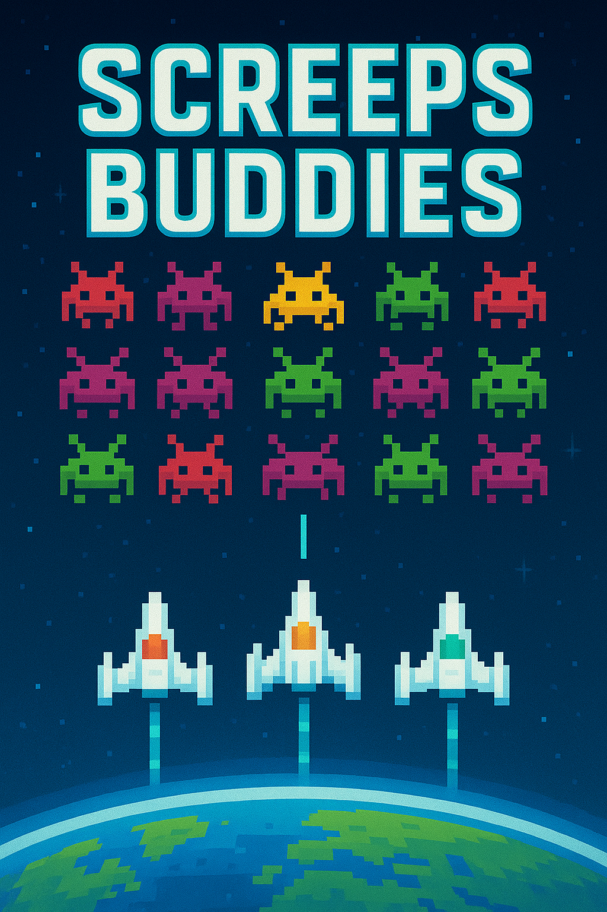

# Screeps Buddies Project

This is the dream coming true for 3 friends to work together towards world dominance. :space_invader: :muscle:

    
    
    

## Getting Started

1. Clone this repo locally and install all dependencies with `npm install` and `yarn`.
2. Move or copy `.env.sample` to `.env` and update it with your [Steam API key](https://steamcommunity.com/dev/apikey).
3. Move or copy `screeps.sample.json` to `screeps.json` and edit it with your credentials.
    * For `main` and `sim` entries, update `token` with your Steam API key.
    * For the `pserver` entry, update `username` and `password` with any values. This will be later on used to configure the auth mod (instructions below)
4. Install [Screeps World](https://store.steampowered.com/app/464350/Screeps_World/) from steam.
5. Install the [screeps-steamless-client](https://github.com/laverdet/screeps-steamless-client).
    * `npm install -g screeps-steamless-client` to install
    * `npx screeps-steamless-client` to run
6. Run the local private server with `docker compose up -d`
7. Configure credentials for your private server
    * This is managed by [screepsmod-auth](https://github.com/ScreepsMods/screepsmod-auth)
    * The credentials should be the same used in Step 3 above.
    * Go to http://127.0.0.1:21025/authmod/password/, configure a new password and log into Steam.
    * Open the server CLI with `docker compose exec screeps cli` and run `setPassword('Username', 'YourDesiredPassword')`
8. You should be good to go!
    * Make your code changes and push it to the branches with the following:
        * `npm run push-main` to push to main/prod
        * `npm run push-sim` to push to sim/dev
        * `npm run push-pserver` to push to local private server

## Troubleshooting

1. If you get the error bellow when running the push command for the first time:
> Error: Package subpath './package.json' is not defined by "exports" in /Users/dcedraz/Screeps/screeps-buddies/node_modules/tslib/package.json

 Try running this: `npm install --save-dev rollup-plugin-typescript2@0.31.0`

## Plugins and helpers

* `screeps-launcher` https://github.com/screepers/screeps-launcher
* `screeps-server` by Jomik https://github.com/Jomik/screeps-server
* `screeps-steamless-client` https://github.com/laverdet/screeps-steamless-client
* `screeps-mods` https://github.com/ScreepsMods

## Notes to run on private server

1. Run the screeps server with `docker compose up -d`
    * Run `docker compose logs screeps -f` to see the server logs
    * `docker compose stop` - This will stop the containers, but not remove them, so starting is quicker again.
    * `docker compose down -v` - This removes containers, networks and volumes.
    * Run `docker compose exec screeps cli` to open the server CLI.
2. Steamless client: `npx screeps-steamless-client`
   * http://localhost:8080/(https://screeps.com)/
   * http://localhost:8080/(http://localhost:21025)/
3. Auth mod commands:
   * Open the server cli `docker compose exec screeps cli` to run commands
   * setPassword('Username', 'YourDesiredPassword')
4. Admin common commands:
   * system.resetAllData()
   * system.pauseSimulation()
   * utils.removeBots()
   * utils.getStats()
   * system.setTickDuration(1000)
   * Update controller and other objects:
        * `storage.db['rooms.objects'].update({ _id: 'idOfController' },{ $set: { level: 8 }})`

### Fork origin

This was a fork from eduter's [screeps-typescript-jest-starter](https://github.com/eduter/screeps-typescript-jest-starter), which demonstrates how to unit test your [Screeps](https://screeps.com/) bot with [Jest](https://jestjs.io/), and to serve as a starting point for those who want to do the same. For anything else, go to [Screeps-typescript-starter](https://github.com/screepers/screeps-typescript-starter).
